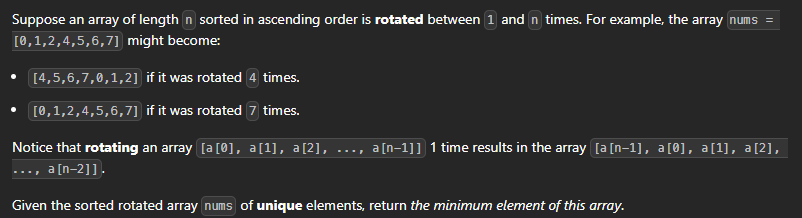
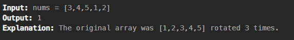
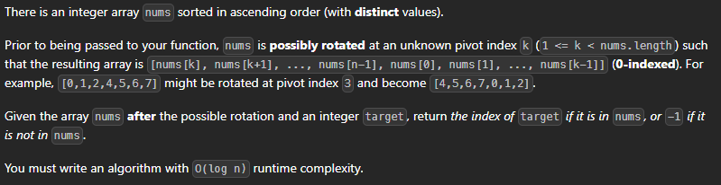
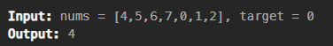
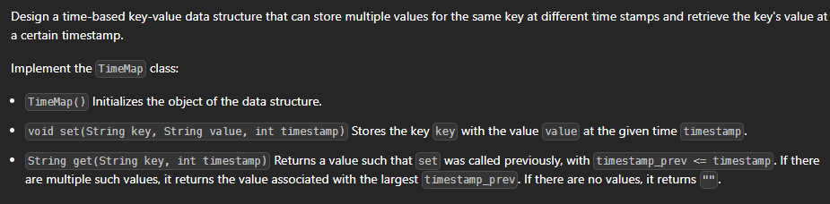
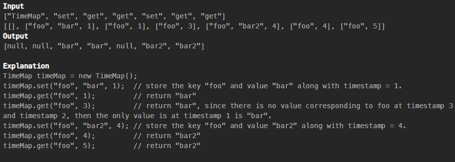
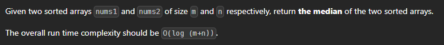
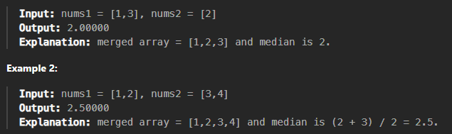

# Binary Search

### 1. Simple Binary Search[- LeetCode](https://leetcode.com/problems/binary-search/description/)


```cpp
class Solution {
public:
    int search(vector<int>& nums, int target) {
        int mid = 0;
        int start = 0;
        int end = nums.size() - 1;

        while(start <= end) {
            mid = start + (end - start)/2;
            if(target == nums[mid]){
                return mid;
            }
            else if (target <= nums[mid]){
                end = mid - 1;
            }
            else{
                start = mid + 1;
            }
        }
        return -1;
    }
};
```

---

---

---

### 2. Search in 2D matrix [- LeetCode](https://leetcode.com/problems/search-a-2d-matrix/)


#### hint - apply BS 2 times (First to find extact row and nex tot find element in that row)

```cpp
class Solution {
public:
    bool searchMatrix(vector<vector<int>>& matrix, int target) {
        int top = 0;
        int bot = matrix.size() - 1;

        while (top <= bot) {
            int mid = (top + bot) / 2;

            if (matrix[mid][0] < target && matrix[mid][matrix[mid].size() - 1] > target) {
                break;
            } else if (matrix[mid][0] > target) {
                bot = mid - 1;
            } else {
                top = mid + 1;
            }
        }

        int row = (top + bot) / 2;

        int left = 0;
        int right = matrix[row].size() - 1;

        while (left <= right) {
            int mid = (left + right) / 2;

            if (matrix[row][mid] == target) {
                return true;
            } else if (matrix[row][mid] > target) {
                right = mid - 1;
            } else {
                left = mid + 1;
            }
        }

        return false;        
    }
};
```

---

---

---

### 3. Koko eating bananas

(Basically we are tyring to reduce the search space,, so first we will plot the min k value that koko will have and max she can have. and then we will skrink the search space using BS)

solution link - [Koko Eating Bananas - Binary Search - Leetcode 875 - Python - YouTube](https://www.youtube.com/watch?v=U2SozAs9RzA)


hint - 

```cpp
class Solution {
public:
    int minEatingSpeed(vector<int>& piles, int h) {
        int start = 1;
        int end = *max_element(piles.begin(),piles.end());
        while(start < end)
        {
            int mid = start + (end - start)/2;
            int total = 0;
            for(int pile : piles)
            {
                total = total + ceil((double)pile / mid);
            }
            if(total > h)
            {
                start = mid + 1;
            }
             else {
                end = mid;
            }
        }
        return start;
    }
};  
```

---

---

---

### 4. BS on rotated sorted array - m

[- LeetCode ](https://leetcode.com/problems/find-minimum-in-rotated-sorted-array/) Solution - [YouTube](https://www.youtube.com/watch?v=nIVW4P8b1VA&t=2s)





```cpp
class Solution {
public:
    int findMin(vector<int>& nums) {
         int left = 0; // Start index
        int right = nums.size() - 1; // End index

        // Binary search to find the minimum element
        while (left < right) {
            int mid = left + (right - left) / 2; // Calculate mid-point

            // If mid element is greater than the rightmost element, the minimum is in the right half
            if (nums[mid] > nums[right]) {
                left = mid + 1; // Move left to mid + 1
            } else { // Otherwise, the minimum is in the left half including mid
                right = mid; // Move right to mid
            }
        }
        return nums[left]; 
    }
};
```

---

---

---

### 5. Find target element in rotated sorted array

simple - basically you check if mid is your target if not you check if the left most elemet is shorer than mid if yes that left is sorted and you quickly check is target is present there is target is not present there you simply move the left pointer to mid + 1 and if it is present you move right pointer to mid - 1.





```cpp
class Solution {
public:
    int search(vector<int>& nums, int target) {
       int left = 0;
        int right = nums.size() - 1;

        while (left <= right) {
            int mid = left + (right - left) / 2;

            if (nums[mid] == target) {
                return mid; // Target found
            }

            // Determine which half is sorted
            if (nums[left] <= nums[mid]) {
                // Left half is sorted
                if (nums[left] <= target && target < nums[mid]) {
                    right = mid - 1; // Target is in the left half
                } else {
                    left = mid + 1; // Target is in the right half
                }
            } else {
                // Right half is sorted
                if (nums[mid] < target && target <= nums[right]) {
                    left = mid + 1; // Target is in the right half
                } else {
                    right = mid - 1; // Target is in the left half
                }
            }
        }

        return -1; // Target not found
    }
}; 
```

---

---'>>' is used short hand for divide by 2.

---

### 6. Time Based Key-Value Store [- LeetCode](https://leetcode.com/problems/time-based-key-value-store/description/)





```cpp
class TimeMap {
public:
    // Constructor to initialize the object
    TimeMap() {
        // Initialization code, if needed
    }

    // Method to store the key with value and timestamp
    void set(std::string key, std::string value, int timestamp) {
        store[key].push_back({timestamp, value});
    }

    // Method to get the value for a key at the given timestamp
    std::string get(std::string key, int timestamp) {
        if (store.find(key) == store.end()) {
            return ""; // If the key doesn't exist, return an empty string
        }

        auto& values = store[key];

        int left = 0, right = values.size() - 1;
        while (left <= right) {
            int mid = left + (right - left) / 2;
            if (values[mid].first == timestamp) {
                return values[mid].second; // Exact timestamp match
            } else if (values[mid].first < timestamp) {
                left = mid + 1; // Look on the right side
            } else {
                right = mid - 1; // Look on the left side
            }
        }

        if (right >= 0) {
            return values[right].second; // Closest earlier timestamp match
        }

        return ""; // If no valid timestamp is found, return an empty string
    }

private:
    // Map to store the key with its list of (timestamp, value) pairs
    std::map<std::string, std::vector<std::pair<int, std::string>>> store;
};
```

---

---

---

### 7. Merge sort problem technique used (Hard)

[Solution - LeetCode](https://leetcode.com/problems/median-of-two-sorted-arrays/solutions/4070500/99-journey-from-brute-force-to-most-optimized-three-approaches-easy-to-understand/)



            

```cpp
class Solution {
public:
    double findMedianSortedArrays(vector<int>& nums1, vector<int>& nums2) {
        // Get the sizes of both input arrays.
        int n = nums1.size();
        int m = nums2.size();

        // Merge the arrays into a single sorted array.
        vector<int> merged;
        for (int i = 0; i < n; i++) {
            merged.push_back(nums1[i]);
        }
        for (int i = 0; i < m; i++) {
            merged.push_back(nums2[i]);
        }

        // Sort the merged array.
        sort(merged.begin(), merged.end());

        // Calculate the total number of elements in the merged array.
        int total = merged.size();

        if (total % 2 == 1) {
            // If the total number of elements is odd, return the middle element as the median.
            return static_cast<double>(merged[total / 2]);
        } else {
            // If the total number of elements is even, calculate the average of the two middle elements as the median.
            int middle1 = merged[total / 2 - 1];
            int middle2 = merged[total / 2];
            return (static_cast<double>(middle1) + static_cast<double>(middle2)) / 2.0;
        }
    }
};
```
