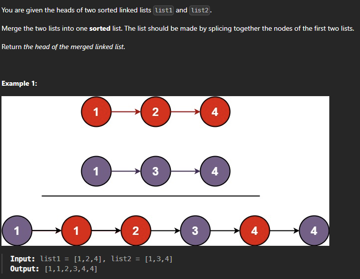

### 1. Reverse a Linked List

[- LeetCode](https://leetcode.com/problems/reverse-linked-list/description/)


- Recursively 

- Iteratively - 2 Pointers
  
  ---
  
  Iteratievly - you will have one null node at the start which points to null

---

2 pointer

```cpp
class Solution {
public:
    ListNode* reverseList(ListNode* head) {
        ListNode* prev=NULL;
        ListNode* curr=head;
        if(head==NULL)
            return head;
        while(head!=NULL)
        {
            curr=head;
            head=head->next;
            curr->next=prev;
            prev=curr;
        } 
        return prev;
    }
};
```

---

---

---IF you create dummy node you will be safe from edge case of null list in LinkList---

---

---

### 2. Merge Two linked List

[- LeetCode](https://leetcode.com/problems/merge-two-sorted-lists/)

CONDITION - we cannot create new node

Question - 

```cpp
    ListNode* mergeTwoLists(ListNode* list1, ListNode* list2) {
        if (list1 == NULL && list2 == NULL) {
            return NULL;
        }
        if (list1 == NULL) {
            return list2;
        }
        if (list2 == NULL) {
            return list1;
        }

        ListNode* dummy = new ListNode();
        ListNode *curr = dummy;
        while (list1 != NULL && list2 != NULL) {
            if (list1->val <= list2->val) {
                curr->next = list1;
                list1 = list1->next;
            } else {
                curr->next = list2;
                list2 = list2->next;
            }
            curr = curr->next;
        }

        if (list1 == NULL) {
            curr->next = list2;
        } else {
            curr->next = list1;
        }

        return dummy->next; 
    }
```


### Linked list

```cpp

```
