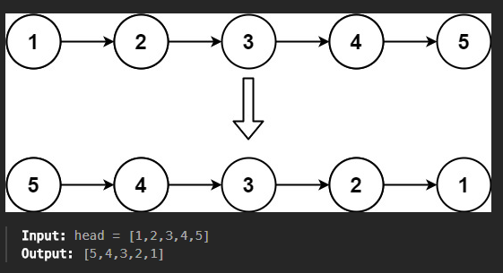

### 1. Reverse a Linked List

[- LeetCode](https://leetcode.com/problems/reverse-linked-list/description/)




- Recursively 

- Iteratively - 2 Pointers
  
  ---
  
  Iteratievly - you will have one null node at the start which points to null

---

2 pointer

```cpp
class Solution {
public:
    ListNode* reverseList(ListNode* head) {
        ListNode* prev=NULL;
        ListNode* curr=head;
        if(head==NULL)
            return head;
        while(head!=NULL)
        {
            curr=head;
            head=head->next;
            curr->next=prev;
            prev=curr;
        } 
        return prev;
    }
};
```
