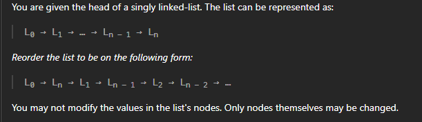
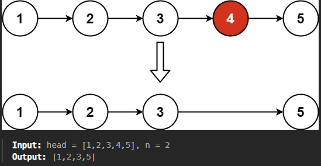
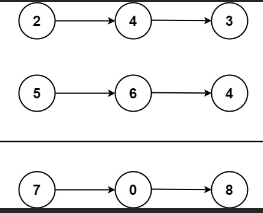

### 1. Reverse a Linked List

[- LeetCode](https://leetcode.com/problems/reverse-linked-list/description/)


- Recursively 

- Iteratively - 2 Pointers
  
  ---
  
  Iteratievly - you will have one null node at the start which points to null

---

2 pointer

```cpp
class Solution {
public:
    ListNode* reverseList(ListNode* head) {
        ListNode* prev=NULL;
        ListNode* curr=head;
        if(head==NULL)
            return head;
        while(head!=NULL)
        {
            curr=head;
            head=head->next;
            curr->next=prev;
            prev=curr;
        } 
        return prev;
    }
};
```

---

---

---IF you create dummy node you will be safe from edge case of null list in LinkList---

---

---

### 2. Merge Two linked List

[- LeetCode](https://leetcode.com/problems/merge-two-sorted-lists/)

CONDITION - we cannot create new node

Question - 

```cpp
    ListNode* mergeTwoLists(ListNode* list1, ListNode* list2) {
        if (list1 == NULL && list2 == NULL) {
            return NULL;
        }
        if (list1 == NULL) {
            return list2;
        }
        if (list2 == NULL) {
            return list1;
        }

        ListNode* dummy = new ListNode();
        ListNode *curr = dummy;
        while (list1 != NULL && list2 != NULL) {
            if (list1->val <= list2->val) {
                curr->next = list1;
                list1 = list1->next;
            } else {
                curr->next = list2;
                list2 = list2->next;
            }
            curr = curr->next;
        }

        if (list1 == NULL) {
            curr->next = list2;
        } else {
            curr->next = list1;
        }

        return dummy->next; 
    }
```

### 3. Reorder list

question - [- LeetCode](https://leetcode.com/problems/reorder-list/description/)

solutioj - [YouTube](https://youtube.com/watch?v=S5bfdUTrKLM&t=3s)



Bascially you have to divide the list in two half and then reverse the second half and then merge both list part.
To find center of linked list you can use slow-fast pointer where each time slow moves one step and fast moves 2 steps int this way when fat will be at the end the so+low pointer will be at the center.

Thats it then just reverse second half and then merge it with first one.

```cpp
class Solution {
public:
 ListNode* reverse(ListNode* head)
    {
        ListNode* prev=NULL;
        ListNode* curr=head;
        ListNode* nxt=NULL;

        while(curr)
        {
            nxt=curr->next;
            curr->next=prev;
            prev=curr;
            curr=nxt;
        }
        return prev;
    }

    void reorderList(ListNode* head) {
        ListNode* slow = head;
        ListNode* fast = head->next;

        //By doing this slow will reach on half and fast will reach to last
        while(fast && fast->next){
            slow = slow->next;
            fast = fast->next->next;
        }

        //Now seperate the list in two part
        ListNode* secondReversed = reverse(slow->next);  //Reverse second linkedList
        ListNode* first = head;
        slow->next = NULL;

        //Now merge both linkedList

        while(secondReversed)
        {
            ListNode* temp1=first->next;
            ListNode* temp2=secondReversed->next;
            first->next=secondReversed;
            secondReversed->next=temp1;
            first=temp1;
            secondReversed=temp2;
        }

    }
};
```

---

---

---

### 4. Remove the nth element from the list

Solution - [YouTube](https://www.youtube.com/watch?v=XVuQxVej6y8)

if you say n = 2 you remove the 2nd node from linkedlist

Solution is simple - you will have 2 pointers and nowthe offset or distance bwteen these two pointer will be `n` so first you will loop for `fast`pointer to be n values far from slow pointer.
Now you will move slow and fast pointer both with consant speed untill fast pointer reachs NULL.
Boz wehn `fast`reaches NULL then slow will be pointer to the element we want to remove.



```cpp
    ListNode* removeNthFromEnd(ListNode* head, int n) {
        ListNode* fast = head;
        ListNode* slow = head;

        int length = 0;

        while(n--){
            fast = fast->next;
        }
        if(fast == NULL){
            return slow->next;
        }

        while(fast->next != NULL){
            slow = slow->next;
            fast = fast->next;
        }
        slow->next = slow->next->next;
        return head;
    }
```

---

---

---

### 5. Add two numbers




```cpp
    ListNode* addTwoNumbers(ListNode* l1, ListNode* l2) {

        ListNode* l3 = new ListNode(0);
        ListNode* head;
        int carry = 0;
        head = l3;


        while(l1 && l2){
            int value = l1->val + l2->val + carry;
            carry = value/10;
            l3->next = new ListNode(value%10);
            l3 = l3->next;
            l1 = l1->next;
            l2 = l2->next;
        }

        while(l1){
            int value = l1->val + carry;
            carry = value/10;
            l3->next = new ListNode(value%10);
            l1 = l1->next;
            l3 = l3->next;
        }

        while(l2){
            int value = l2->val + carry;
            carry = value/10;
            l3->next = new ListNode(value%10);
            l2 = l2->next;
            l3 = l3->next;
        }
        
        if(carry){
            l3->next = new ListNode(carry);
        }
        return head->next;
    }
```
